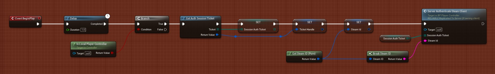

# Authenticating Steam Users 

:::tip SteamCore PRO 1.0.3.1 and newer
If you are using SteamCore PRO **1.0.3.1** and newer you can automatically authenticate players on your dedicated server by using the new SteamCore Auth Module.

- Add this to your **DefaultEngine.ini**
```cpp
[PacketHandlerComponents]
+Components=OnlineSubsystemSteamCore.SteamCoreAuthComponentModuleInterface
```
:::

:::tip
When using the SteamCore Auth Module the plugin will handle everything for you. You will have to disable/remove your old authentication code if you are using the old authentication method shown below.
:::


:::warning BEWARE
THE BLUEPRINT NODES ARE NOT REQUIRED AND SHOULD NOT BE USED IF YOU ARE USING THE AUTH MODULE MENTIONED IN THE BEGINNING OF THIS PAGE.
:::


:::warning DEPRECATED WAY, SHOULD NOT BE USED
## PlayerController



## Begin Auth Session
Depending on your setup, if you are using Dedicated Servers to authenticate users use “GameServer” example, if you are using a “Single Player” or “Listen Server” setup use the “User” example.


## Cleaning Up
Destroy/Invalidate the authenitcation ticket when the player exits the game (Inside the PlayerController)


:::