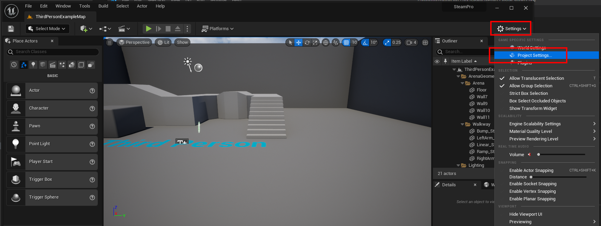
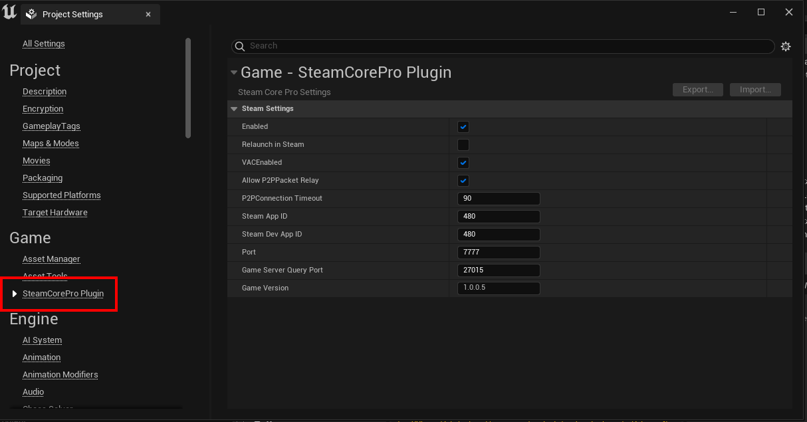

# Configuring the Plugin


## Project Settings
- You can configure some plugin settings in the Project Settings menu.



## Settings
- It's possible to do some initial testing using the public appid 480 but it's strongly recommended that you get your own Appid as soon as possible.



## DefaultEngine.ini
- Edit your projects DefaultEngine.ini (located in Project\Config\DefaultEngine.ini), these are the **minimum** settings required in order to use SteamCore PRO. To use Multipayer you'll also have to configure [SteamCoreSockets](../multiplayer/configuring_steamsockets.md)

```
[OnlineSubsystemSteamCore]
bEnabled=True
SteamDevAppId=480
SteamAppId=480

[OnlineSubsystem]
DefaultPlatformService=SteamCore
```