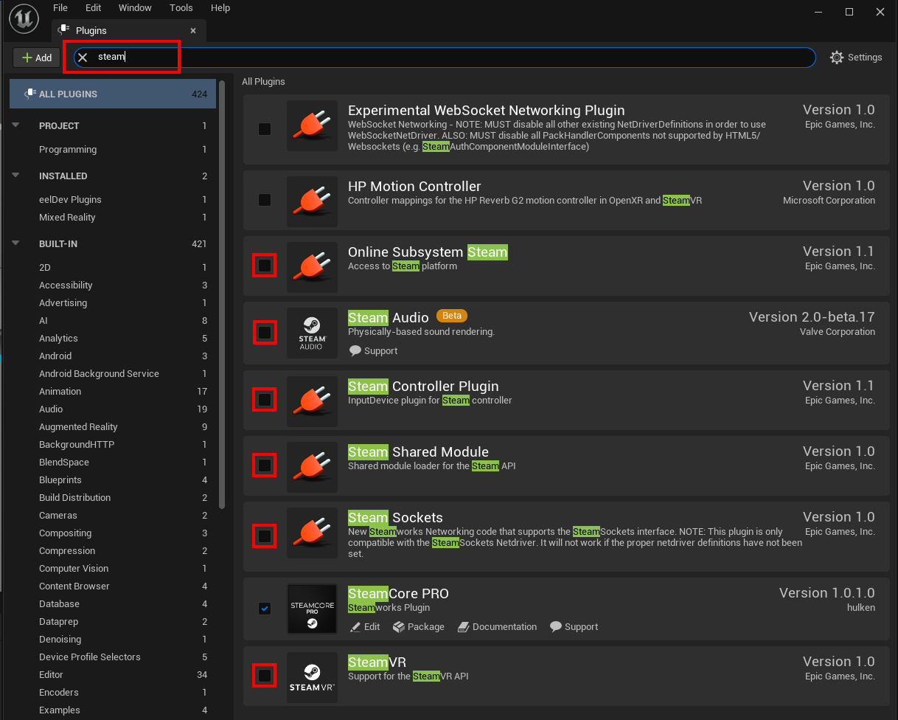

# Installing the plugin

## Installing
- You can only install the plugin via the Epic Launcher

## Disable Engine Steam Plugins


### Select your Engine Version


### Moving the plugin
- Move (not copy) the plugin from the engines marketplace directory to your own projects Plugins directory, you may have to create the Plugins directory in your project if it doesn't exist.
```
Example Location: 
C:\Program Files\Epic Games\UE_4.27\Engine\Plugins\Marketplace
```


### Force Plugin/Project recompile (optional)
- Delete the Binaries, Build, Intermediate and Saved folders inside your project directory.


- Delete the Binaries and Intermediate folders inside the SteamCore plugin directory


## C++ project
- If this is a C++ project, add "SteamCorePro" as a module dependency in your projects Build.cs file.


### Enable the Plugin
