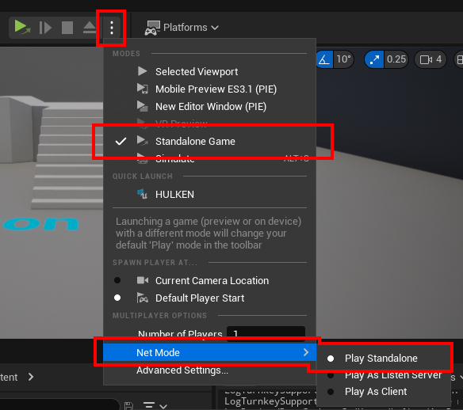

# Testing Steam Functionality

## Requirements When Testing
:::note
There are a couple of requirements when testing Steam functionality that may not be so obvious.
:::

- Make sure you’ve configured Steam in your DefaultEngine.ini, you can find the DefaultEngine.ini settings here
- You must have the Steam Client running and be Logged In
- The client logged into steam must own the game, either add them to the organization for the app or request steam keys from Valve to add the game to their library

## Testing as a Packaged Build
- Package your game as a **Development Build** (not a shipping build) when testing on your own PC.
- If you package your game as a **Shipping Build**, you must upload it to Steam and launch the game through the Steam Client.

## Packaging the Project (using the Project Launcher)

## Use the back button after configuring the profile

## Start packaging by clicking on this button

## Testing Multiplayer
:::danger NOTE
You must use a Packaged game build to test multiplayer, testing in the editor is not going to work
:::
- If you want to test Multiplayer using Steam, you must use 2 different computers and 2 different accounts.
- You can use 1 computer and 1 virutal machine if you don’t own 2 computers.

## Testing in the Editor (UE4)
- When testing Steam Funcionality in the Editor you must launch a Standalone Game instance or Steam will not Initialize.

## Testing in the Editor (UE5)
- When testing Steam Funcionality in the Editor you must launch a Standalone Game instance or Steam will not Initialize.

 