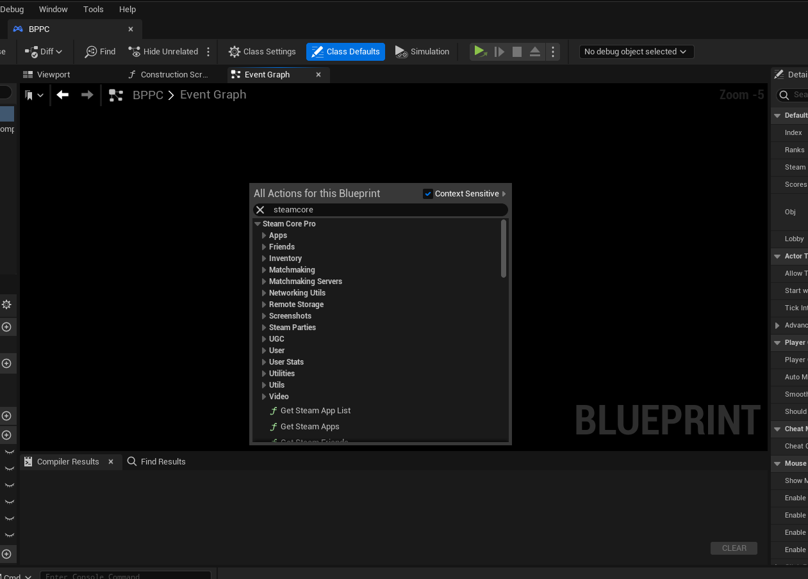

# Using the Plugin

## Testing Steam Functionality
To test steam functionality properly, see the [Testing Steam Functionality Documentation](testing_steam_functionality.md)

## SteamCore Functionality
- Search for **SteamCore** in the blueprint context menu and you'll find all the available plugin nodes.

## Steamworks Documentation
- All the Blueprint nodes are named the same as in the official steamworks documentation, the only difference is that you'll be using blueprint nodes instead.
- Steamworks Documentation: [https://partner.steamgames.com/doc/api](https://partner.steamgames.com/doc/api)

## Async Functions
- The plugin has a lot of Async functions that allows you to run tasks async without freezing the game, however it's important that you connect the blueprint nodes to the right **output** node.

:::tip
Always use the "Callback" execution pin when you use the Async functions
:::

### More Async Functions
- You can find more Async functions if you look in the blueprint context menu under "steamcore" and the "async" category.

## Delegates
- The Steamworks SDK has a lot of different delegates that can be bound and used when needed, these delegates are also available with the SteamCore plugin and enables you to use them in your Blueprints.

### Assign the delegate
- Using the "assign" keyword will automatically create the correct event signature needed for the delegate.

### Delegate bound
This is how a "bound" delegate looks like, for example this event will execute every time steam notices a change to a friends Avatar.

Here is another example, when a lobby join is requested in the friends interface this event will be executed from the Steam Client.

### More on Delegates
- You can find more information about the available delegates on the [**Steamworks Website**](https://partner.steamgames.com/doc/api/ISteamFriends#callbacks)