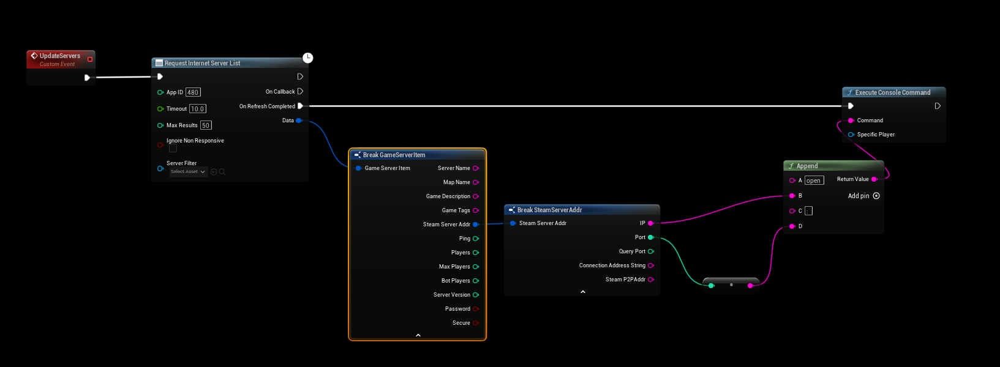

# Connecting to the Server

:::tip TIP
This Example has a Video Tutorial that you can find here: [Related Video](../../videos/dedicated-server.mdx)
:::

Depending on your DefaultEngine.ini setup the method for connecting to the Dedicated Server is different. Below are two examples for connecting to a dedicated server (both using Execute console command).

## Using Find SteamCore PRO Sessions
- [Use in conjunction with the SteamCoreSockets NetDriver](../../multiplayer/configuring_steamsockets.md)
- If you're using the **Find SteamCore PRO Sessions** to find multiplayer sessions you can use the **Join Session** node to join a dedicated multiplayer session.
- The example below should not be used in a live product, it's simply a demonstration that will join the first server found. Ideally you want to build a server list, see the bluerpint example project for a working example.

## Using SteamCoreSockets Setup and Console Command (bypass OnlineSubsystem)
- [Configuration Example when using SteamCoreSocketsNetDriver](../../multiplayer/configuring_steamsockets.md)
- The console command should look like this: (**open steam.xxxx:port**), replace xxxx with the servers Steam P2PAddr and port with the servers port, see the sample below.
- The example below should not be used in a live product, it's simply a demonstration that will join the first server found. Ideally you want to build a server list, see the bluerpint example project for a working example.

## Using IpNetDriver Setup and Console Command (bypass OnlineSubsystem)
- [Configuration Example when using IpNetDriver](../../additional/configuring_ipnetdriver.md)
- The console command should look like this: (**open serverIP:port**), replace xxxx with the servers IP Address and port with the servers port, see the sample below.
- The example below should not be used in a live product, it's simply a demonstration that will join the first server found. Ideally you want to build a server list, see the bluerpint example project for a working example.

