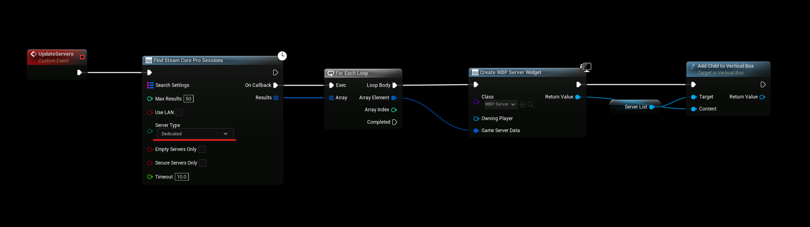
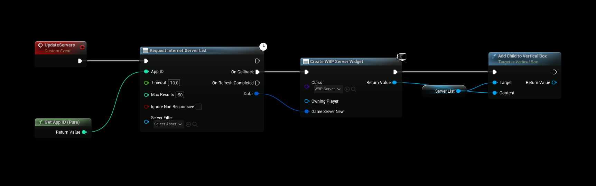

# Finding the Server
:::tip TIP
This Example has a Video Tutorial that you can find here: [Related Video](../../videos/dedicated-server.mdx)
:::

Depending on your preference and setup there are 2 ways of finding your server(s), if you don't know which one to use then give both a try and see what works best for you.

## Find SteamCore PRO Sessions
- This example is simpler to use but has less server information exposed.

## Request Internet Server List
