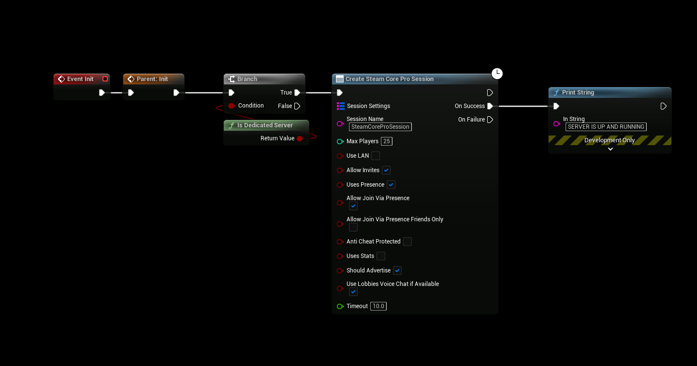
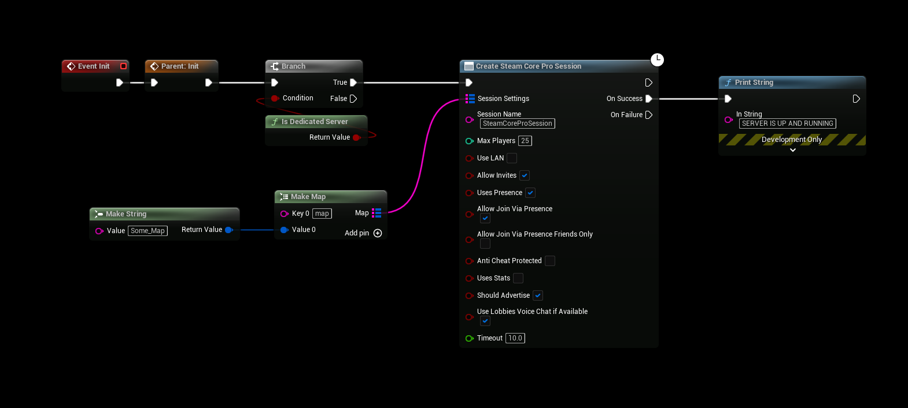
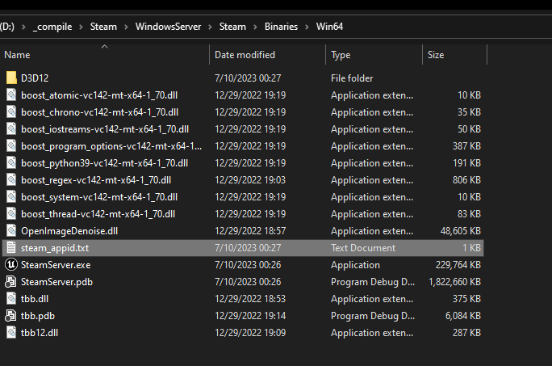

# Initializing the Dedicated Server
:::tip TIP
This Example has a Video Tutorial that you can find here: [Related Video](../../videos/dedicated-server.mdx)
:::

### Initializing using SteamCore Online Subsystem (OSS)
- After configuring your server (DefaultEngine.ini) all you really have to do is call the "Create SteamCore PRO Session" and the dedicated server will initialize itself using the SteamCore Online Subsystem.



### Server Attributes
- You can also include custom attributes for your server, such as the game map or game mode.



# Steam Functionality
If you want to use Steam functionality on your server you'll have to copy the steamclient libraries to your dedicated server, see the examples below.

## steamclient libs

### Windows Server
- Locate the steamclient libs


- Copy the steamclient libs to the same location as your servers executable


### Linux Server
- Locate your steamclient.so file

```cpp
hulken@gameserver:~$ find . -name "*steamclient.so*"
./.local/share/Steam/steamcmd/linux32/steamclient.so
./.local/share/Steam/steamcmd/linux64/steamclient.so
./.steam/sdk64/steamclient.so
``` 

#### Copy the steamclient.so file to your server location
```cpp
cp /home/hulken/.local/share/Steam/steamcmd/linux64/steamclient.so /home/hulken/LinuxServer/STEAM/Binaries/Linux/
```

## steam_appid.txt
- In some cases the server does not have permissions to create the steam_appid.txt automatically so you can do this manually by creating a steam_appid.txt at the root of the server, the contents of your steam_appid.txt should only contain your **Steam AppId** and nothing else.

### Windows Example


### Linux Example
```cpp
hulken@gameserver:~/LinuxServer$ echo "480" > Steam/Binaries/Linux/steam_appid.txt
```

## Initializing without OSS
- You can initialize the steam part of the server manually without using the OSS node (Create SteamCore Session). Below is an example of some of the required nodes for the server to be advertised successfully on steam, see the steamworks documentation for more information about which nodes are required.

