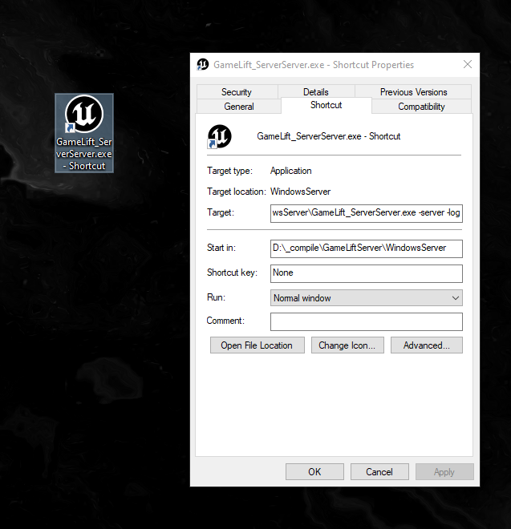

# Launching the Server

# Information
- To launch your dedicated server you first have to package the dedicated server application using unreal engines Project Launcher or Project Packager.
- When you have your executable (*ProjectServer.exe* for exmaple) then you can use the examples below.

## Packaging Project
- [https://docs.unrealengine.com/4.27/en-US/Basics/Projects/Packaging/](https://docs.unrealengine.com/4.27/en-US/Basics/Projects/Packaging/)


## Launching the Server
- Locate your server executable and make a shortcut to the executable **GameLift_ServerServer.exe** (this is just an example, the executable name will depend on what your project is called).


### Server Shortcut
- You'll have to append -server and -log to the **Target**. 



```
D:\_compile\GameLiftServer\WindowsServer\GameLift_ServerServer.exe -server -log
```

You'll have to change the path to the executable depending on your own project, these are only examples that apply to this specific project.

### Starting the Server
- Start the server by using the shotcut from the previous step, this will start the server and display a log output.

