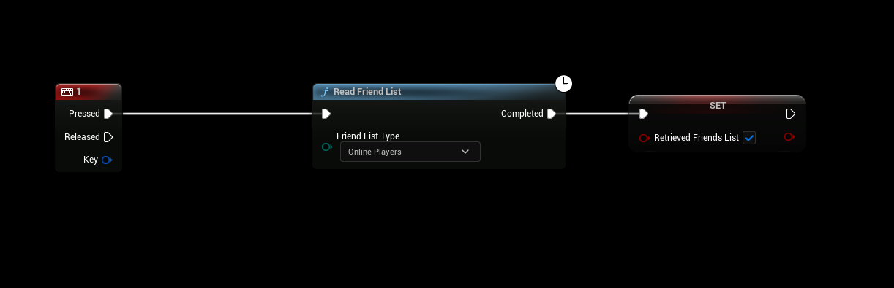
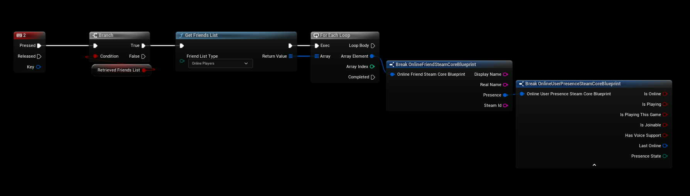

# Friend List
- Requires SteamCore PRO **1.0.2.4** and later
- You can find more examples in the [Blueprint Example Project](../../../example-project.md)

## Listing Friends
- Newer versions of SteamCore PRO now has a simpler method for retrieving a list of friends, you can still list friends using the traditional way (by using Steamworks SDK nodes) but if you need a simpler way you can use the methods below.

## Querying Friends
- You first have to query/retrieve a copy of your friends list from steam, you can do that by calling "Read Friend List"

## Listing Friends
- After retrieving a list of your friends from Steam (see above), you can list all found friends using the Friend List Type.
- Make sure that you do not call this function before **Read Friend List** has returned **Completed**

