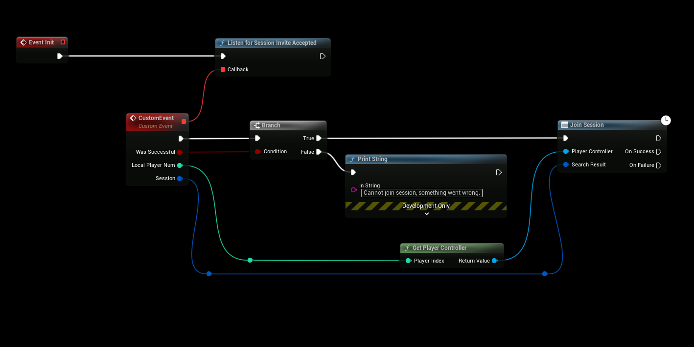
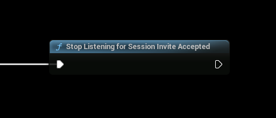
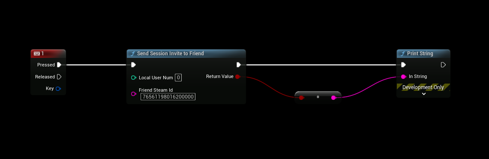
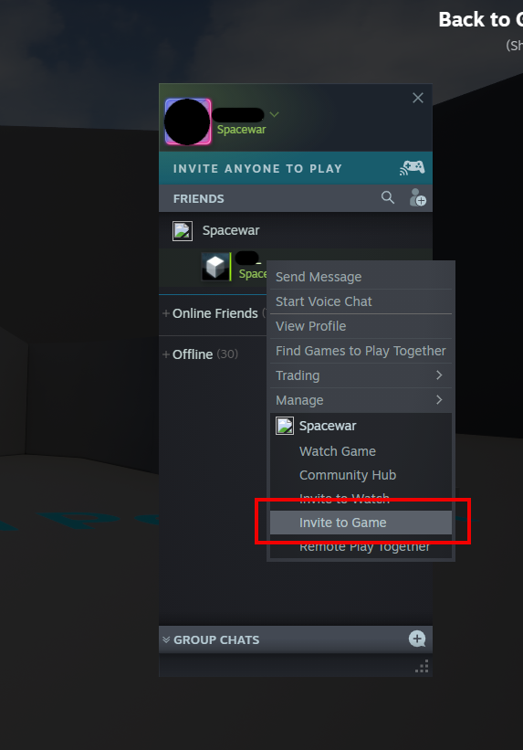

# Inviting Friends
- Requires SteamCore PRO **1.0.2.4** and later
- [Steamworks Friends Documentation](https://partner.steamgames.com/doc/api/ISteamFriends#functions)

## Listen for Session Invites
- In this example we're going to be using our Game Instance to listen for session invites.
- This event will trigger when we accept a game invite via the Steam Overlay for example.

## Stop listening for Session Invites
- To stop listening for Session invites, use the node below.

## Inviting from Game
- This example shows you how to invite someone from in game (not using the steam overlay).
- You'll need to retrieve your friends Steam Id to be able to send an invite, [you can use this example to retrieve their Steam Id](../friends/friends_list.md).

## Inviting from Overlay
- You can also invite friends from the Steam Overlay, the event we bound in your game instance in the example above will also trigger when this invite is accepted.

