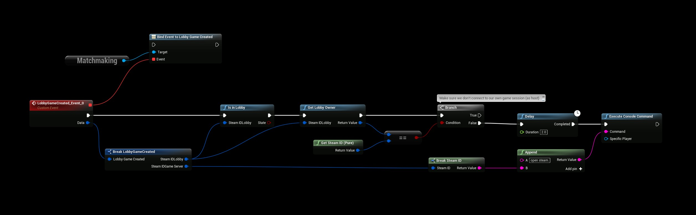
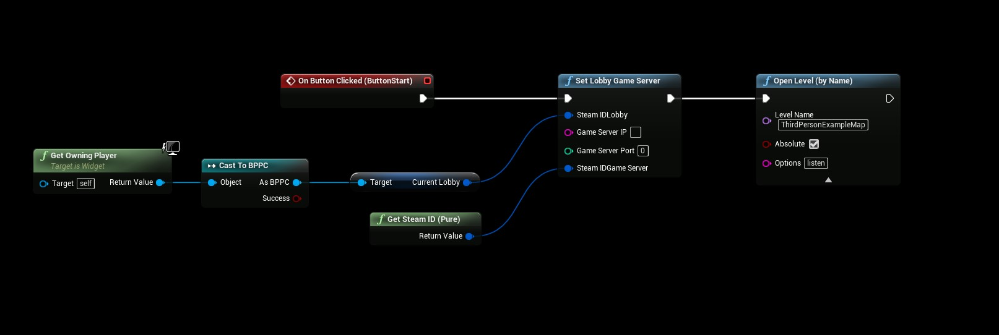

# Lobby to Game Session
In this example we’re going to take a look how to transition from a Lobby to a Game Session using only Blueprints and SteamCore.

# CREATING THE LOBBY

Creating a Steam lobby is rather simple, all you have to do is call the “Create Lobby” function, for a complete lobby setup see the SteamCore Example Project

# LISTENING FOR GAME CREATED

We’re going to bind the “Lobby Game Created” delegate in the Matchmaking system so that we’ll get notified once the game server is available. The branch check in this example is to make sure that once the game is created the delegate will also be invoked on the host and we don’t want the host to try and connect to himself, since we’re using SteamId to connect to the game session we can check if the LobbyOwner is the same as host for the game session.

Then it’s simply a matter of invoking the console command “open steam.SteamId” for the client(s) to connect to the host.

# STARTING THE SESSION

In this example we’re going to be creating a simple game session by opening a level with the “listen” parameter, you could also use the “Create SteamCore Session” node to create your session but this is not covered in this example to keep it simple and understandable.

Calling the function “Set Lobby Game Server” will invoke the delegate we bound earlier on all clients that are inside the lobby, in this case we’re using the SteamSockets/SteamNetDriver so we will use our SteamId as the SteamIdGameServer because clients will use our SteamId when connecting to our server.

Then it’s simply a matter of opening the level with the “listen” parameter, also note that you should not set the lobby game server before the map has actually finished loading on the host, but for simplicitys sake we’re setting the game server first and then loading the map in this example.