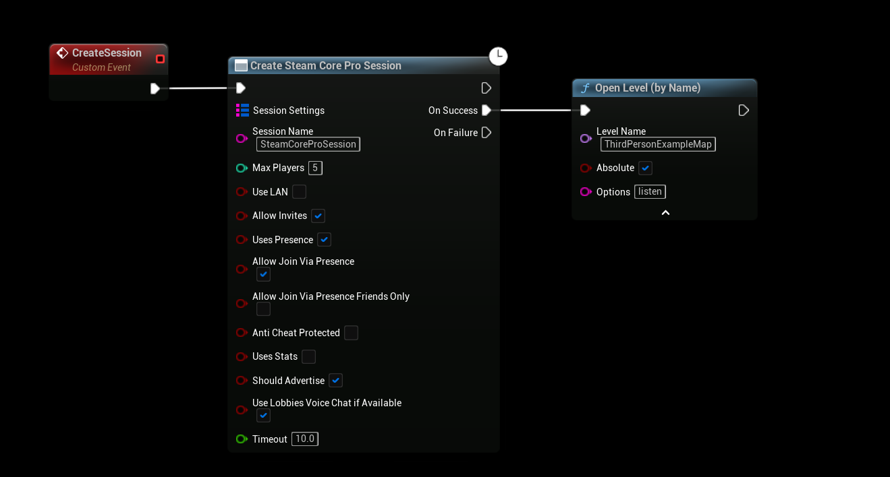

# Creating Multiplayer Games
You can create a Online Game Session using the “Create SteamCore Session” node, if the creation is successfull you open your map with the “listen” options so that it will listen for multiplayer connections

:::tip TIP
This Example has a Video Tutorial that you can find here: [Related Video](../../videos/multiplayer-sessions.mdx)
:::

## Creating the Session
- To create a simple Session all you have to do is call the "**Create SteamCore Session**" node and then open the desired multiplayer level with the **listen** parameter so it will accept multiplayer connections.

