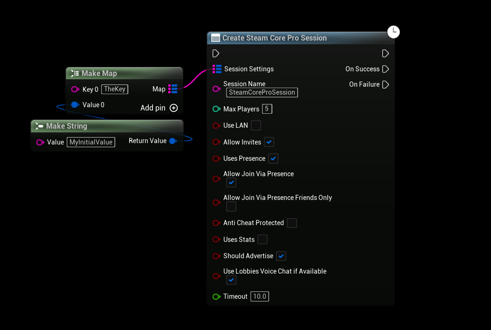
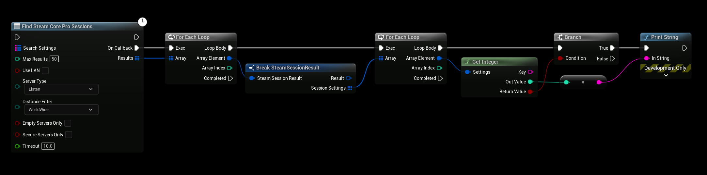
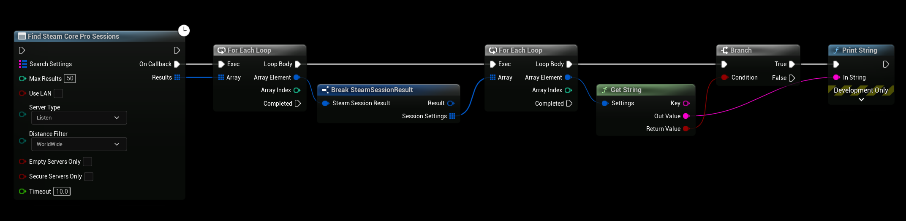
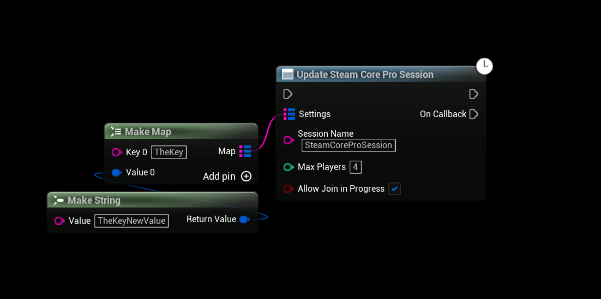

# Custom Session Attributes
You can create sessions with **custom attributes**, in this case we’re using a String, Int and Bool custom attributes with our session, you can use these attributes to filter your search results later or provide additional data for your session

:::tip TIP
This Example has a Video Tutorial that you can find here: [Related Video](../../videos/multiplayer-sessions.mdx)
:::

# Creating a session with an attribute
-  The example below will create a session with the custom attribute "TheKey"

# Fetching Custom Attributes
You can get a sessions custom attributes by looping through the SessionSettings array for the session, see the examples below

 # Updating Session Attributes
 You can also update your custom attributes by calling “Update SteamCore Session“
 
