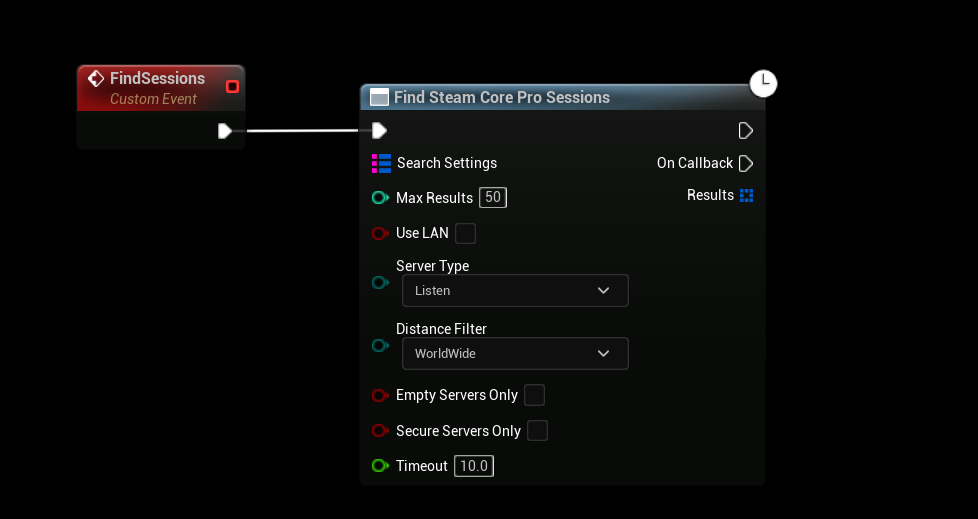

# Finding Multiplayer Games
You can find available sessions by calling “Find SteamCore Sessions“, you can also apply “Search Settings” filters to filter out unwanted sessions

:::tip TIP
This Example has a Video Tutorial that you can find here: [Related Video](../../videos/multiplayer-sessions.mdx)
:::

## Finding Sessions
- To find multiplayer sessions call the **Find SteamCore Sessions** node, this will give you a list with possible sessions to join.

- Ideally you want to create a server list by adding the found sessions to a list of widgets that the user can pick which server to join. See the blueprint sample project for a working server list example.

## Search filtering options
- You can also filter session results using SearchSettings, the example below will only give you results of sessions that have the "UsingSteamCore" bool set to true.

