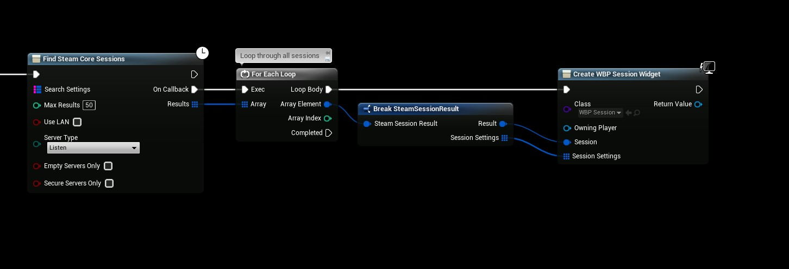

# Password Protected Sessions

If you want to password lock your Game Session or Lobby you can use the SteamCore plugin and it’s bonus utilities to encrypt a password and store it in your game’s session/lobby, let’s take a look at an example how how to set it up

# CREATING THE SESSION

In this example we’re going to set the password to “MySecretPassword“, we’ll use the “Encrypt String” function which is a SteamCore utilities function that will encrypt/hash your string so we don’t have to store the password as clear text.

Then we’ll go ahead and add a Session Attribute of type String and set the string key to “Password” and the Value to our encrypted string.

# VERIFYING THE PASSWORD

You can get a list of attributes a session has stored by looping through the “Session Settings” array that is returned from the “Find SteamCore Sessions” result.

This example is not going to work very well in the real world, it’s meant to give you an idea how to verify the password for a given session, you should instead store the password or the Session Settings array inside the Sessions Widget (for your server/session browser) so you can verify the password before joining the session.

# STORING SESSION SETTINGS

You can store the Sessions Session Settings inside your Widget where you display all servers / sessions like in the example below

# VERIFYING THE PASSWORD
Then before joining the Session we check if the password the user enter is correct by simply comparing the two strings
