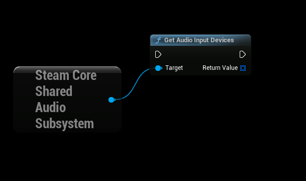
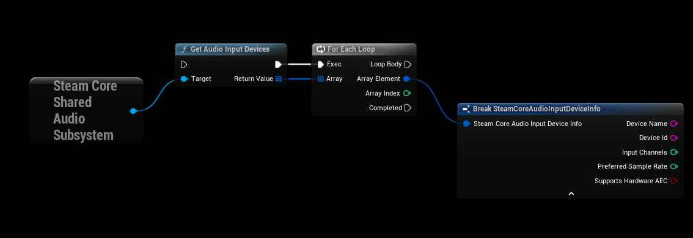
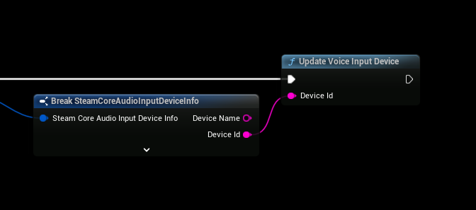
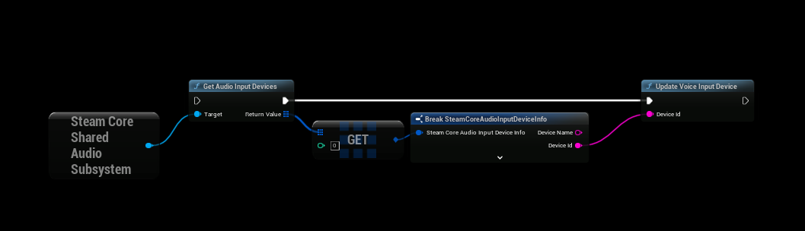
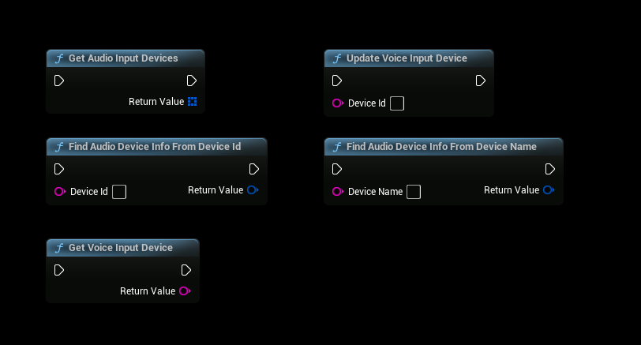

# Select Microphone Input
:::warning NOTE
Requires SteamCore PRO 1.0.5.2 and newer
:::

:::warning NOTE
You will have to restart the game after selecting Microphone Input (if currently in a multiplayer session)
:::

:::tip NOTE

You can find an example of this in the [Blueprint Example Project](../../../example-project.md)
:::

### Getting Supported Input Devices
- To get a list of supported input devices you can use "Get Audio Input Devices", these are devices that the plugin/engine can find and doesn't mean that the device works as it should.

### Audio Device Data
- The "Audio Input Device Info" sturct contains details about the input device

### Selecting Input Device
- Calling the "Update Voice Input Device" node will tell the engine which input device to use when joining/creating a multiplayer session.

### Example of Selecting Input Device
- This example will select the first input device that is found

### Final Notes
- The input device will be used and selected when joining or creating a multiplayer session
- If you're currently in a session you will have to restart the game for the changes to take effect

