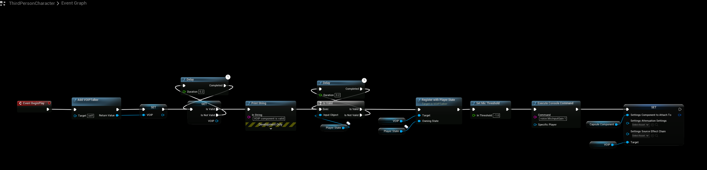
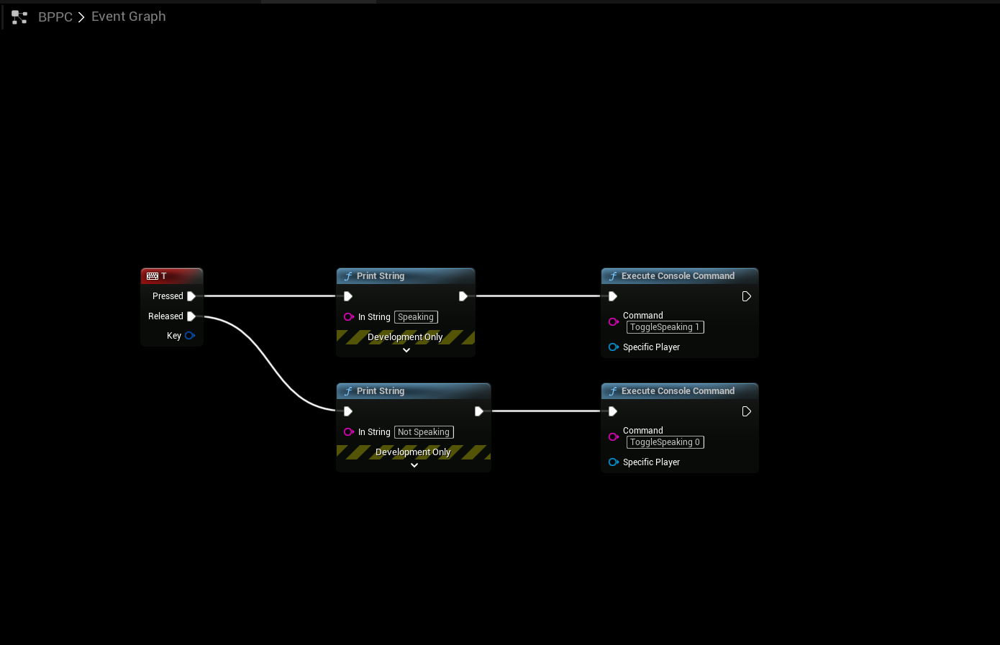

# Voice Chat
## SteamCore Session
- Setting up Voice Chat for SteamCore Online Multiplayer Sessions

:::tip NOTE
This is only going to work with SteamCore Multiplayer Sessions
:::

:::warning NOTE
This is not going to work if you're connecting to a dedicated server using console commands, this is for SteamCore Sessions Only!
:::

### DefaultEngine.ini
- First edit your **DefaultEngine.ini** configuration file and make sure it has these values configured.
```cpp
[Voice]
bEnabled=true

[OnlineSubsystem]
DefaultPlatformService=SteamCore
bHasVoiceEnabled=true

[/Script/Engine.GameSession]
bRequiresPushToTalk=true
```

### Complete DefaultEngine.ini Example
- Below is a configuration example that includes all SteamCore settings (including Voice Chat configuration)
```
[Core.Log]
LogOnlineVoice=Verbose
LogSteamCorePro=Verbose
LogSteamCoreSockets=Verbose
LogSteamCoreShared=Verbose

[OnlineSubsystemSteamCore]
SteamDevAppId=480
SteamAppId=480
bVACEnabled=True
bEnabled=True
bUseSteamNetworking=True
bAllowP2PPacketRelay=True
bRelaunchInSteam=False
P2PConnectionTimeout=90
GameServerQueryPort=27015
GameVersion=1.0.0.5

[Voice]
bEnabled=true

[OnlineSubsystem]
DefaultPlatformService=SteamCore
bHasVoiceEnabled=true

[/Script/Engine.GameSession]
bRequiresPushToTalk=true
```

## Blueprint Setup
- This example is going to utilize the Character and PlayerController blueprints to setup and handle VOIP

### Character Blueprint
- Add the nodes as shown below, make sure to check validity of the VOIP component and the PlayerState as these are not always initialized and present at BeginPlay.



### PlayerController Blueprint
- The PlayerController is going to control the Push to Talk input.



## Testing Voice
- [Testing Steam Functionality](../../getting_started/testing_steam_functionality.md)